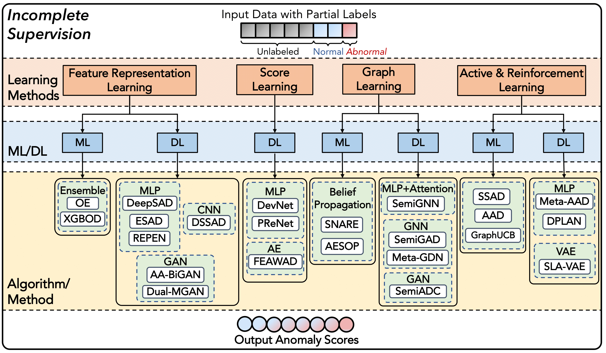
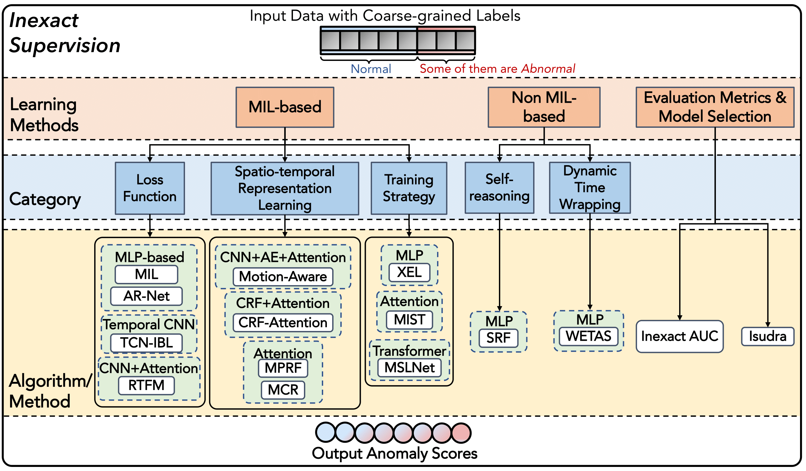
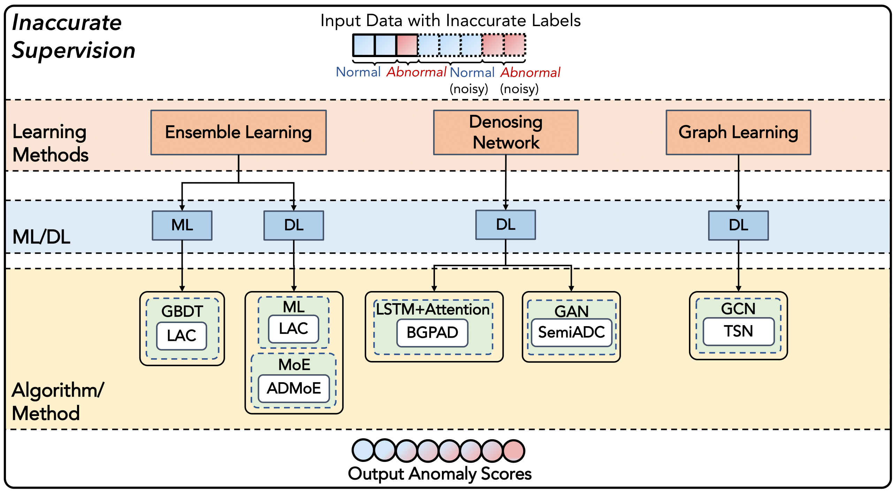

# Weakly-supervised Anomaly Detection: A Survey

This repo is constructed for collecting and categorizing papers about weakly supervised anomaly detection models according to our survey paper——*Weakly Supervised Anomaly Detection: A Survey*

## Summary and categorization of weakly supervised anomaly detection (WSAD) algorithms
We first summarize and further categorize existing WSAD algorithms into three categories, including: 
(i) incomplete supervision; (ii) inexact supervision; (iii) inaccurate supervision
### 1.Summary of WSAD Algorithms
| Method | Reference | Venue | Backbone | Modalities | Key Idea | Official Code |
|:--:|:--:|:--:|:--:|:--:|:--:|:--:|
||||Incomplete Supervision||||
|OE  | [ref](https://www.semanticscholar.org/paper/Learning-Outlier-Ensembles%3A-The-Best-of-Both-Worlds-Micenkov%C3%A1-McWilliams/a517bc0a071be0982150c38c8ac3c52093995106)       | KDD'14  |    -     | Tabular |  Anomaly feature representation learning | ×|
|XGBOD  |[ref](https://ieeexplore.ieee.org/document/8489605)       | IJCNN'18  |   -      | Tabular |  Anomaly feature representation learning | [√](https://github.com/yzhao062/XGBOD)|
|DeepSAD  |[ref](https://iclr.cc/virtual_2020/poster_HkgH0TEYwH.html)       | ICLR'20  | MLP        | Tabular |  Anomaly feature representation learning | [√](https://github.com/lukasruff/Deep-SAD-PyTorch)|
|ESAD      |[ref](https://arxiv.org/abs/2012.04905v1)      |    Preprint      |      MLP      |   Tabular      |  Anomaly feature representation learning                  | ×|
|DSSAD        |[ref](https://ieeexplore.ieee.org/document/9414285)   | ICASSP'21         |    CNN        | Image/Video        |          Anomaly feature representation learning          | ×|
|REPEN    | [ref](https://dl.acm.org/doi/10.1145/3219819.3220042)  | KDD'18   | MLP        | Tabular |      Anomaly feature representation learning                   |  × |
|AA-BiGAN | [ref](https://www.ijcai.org/proceedings/2022/0313.pdf)   | IJCAI'22 | GAN        | Tabular |         Anomaly feature representation learning                | [√](https://github.com/tbw162/AA-BiGAN) |
|Dual-MGAN      |[ref](https://dl.acm.org/doi/10.1145/3522690)        |      TKDD'22     |    GAN       |    Tabular     |     Anomaly feature representation learning                    | [√](https://github.com/leibinghe/Dual-MGAN)|
|DevNet  | [ref](https://dl.acm.org/doi/10.1145/3292500.3330871) | KDD'19   | MLP       | Tabular |   Anomaly score learning  |  [√](https://github.com/GuansongPang/deviation-network)|
|PReNet | [ref](https://arxiv.org/abs/1910.13601) |  Preprint        | MLP       | Tabular |  Anomaly score learning                         |  ×   |
|FEAWAD | [ref](https://ieeexplore.ieee.org/abstract/document/9465358/)   | TNNLS'21  | AE        | Tabular |     Anomaly score learning                       | [√](https://github.com/yj-zhou/Feature_Encoding_with_AutoEncoders_for_Weakly-supervised_Anomaly_Detection)    |
|SNARE    | [ref](https://www.cs.cmu.edu/~mmcgloho/pubs/snare.pdf) | KDD'09    | -          | Graph   |  Graph learning and label propagation |   ×  |
|AESOP    | [ref](https://dl.acm.org/doi/abs/10.1145/2623330.2623342) | KDD'14    |  -         | Graph   |  Graph learning and label propagation  |   ×  |
|SemiGNN  | [ref](https://ieeexplore.ieee.org/document/8970829)      | ICDM'19   | MLP+Attention | Graph   |  Graph learning and label propagation | ×    |
|SemiGAD   | [ref](https://ieeexplore.ieee.org/document/9533507)   | IJCNN'21  | GNN       | Graph   |  Graph learning and label propagation  | × |
|Meta-GDN | [ref](https://dl.acm.org/doi/10.1145/3442381.3449922)       | WWW'21    | GNN       | Graph   |   Graph learning and label propagation |  [√](https://github.com/kaize0409/Meta-GDN_AnomalyDetection)   |
|SemiADC  | [ref](www.sciencedirect.com/science/article/pii/S0020025521003856)      | IS Journal'21 | GAN   | Graph | Graph learning and label propagation|  × |
|SSAD     | [ref](https://dl.acm.org/doi/10.5555/2512538.2512545) | JAIR'13   |  -         | Tabular |   Active learning                  |  ×   |
|AAD      | [ref](https://ieeexplore.ieee.org/document/7837915) | ICDM'16 | -         | Tabular |  Active learning   |   [√](https://github.com/shubhomoydas/pyaad)  |
|SLA-VAE    | [ref](https://dl.acm.org/doi/abs/10.1145/3485447.3511984)      |   WWW'22        |    VAE      |     Time series    |          Active learning                    | × |
|Meta-AAD | [ref](https://ieeexplore.ieee.org/document/9338270)      | ICDM'20   | MLP       | Tabular |  Reinforcement learning |   [√](https://github.com/daochenzha/Meta-AAD)  |
|DPLAN    | [ref](https://dl.acm.org/doi/10.1145/3447548.3467417)     | KDD'21   | MLP       | Tabular |  Reinforcement learning  |  ×   |
|GraphUCB | [ref](https://dl.acm.org/doi/10.1145/3289600.3290964) | WSDM'19 |   -        | Graph   |  Reinforcement learning  |  [√](https://github.com/kaize0409/GraphUCB_AnomalyDetection)   |
||||Inexact Supervision||||
|MIL          |  [ref](https://ieeexplore.ieee.org/document/8578776)   | CVPR'18 | MLP          |  Video  |  Multiple Instance Learning  | [√](https://github.com/vantage-vision-vv/Anomaly-Detection-in-Surveillance-Videos)        
|TCN-IBL       |  [ref](https://ieeexplore.ieee.org/document/8803657) | ICIP'19  | CNN          | Video   |  Multiple Instance Learning  |  ×       
|AR-Net        |  [ref](https://ieeexplore.ieee.org/document/9102722)     |ICME'20   |  MLP         | Video   | Multiple Instance Learning   | [√](https://github.com/wanboyang/Anomaly_AR_Net_ICME_2020)        
|RTFM         |  [ref](https://ieeexplore.ieee.org/document/9710957)    | ICCV'21  | CNN+Attention |  Video  |  Multiple Instance Learning  | [√](https://github.com/tianyu0207/RTFM)            
|Motion-Aware  |  [ref](https://arxiv.org/abs/1907.1021)     | BMVC'19  | AE+Attention| Video   |  Multiple Instance Learning  |   ×     
|CRF-Attention    |  [ref](https://ieeexplore.ieee.org/document/9710685) |ICCV'21   | TRN+Attention    |  Video  |  Multiple Instance Learning  |      ×   
|MPRF         |  [ref](https://www.ijcai.org/proceedings/2021/0162.pdf)       |IJCAI'21  | MLP+Attention     |  Video  |  Multiple Instance Learning  |   ×      
|MCR         |  [ref](https://ieeexplore.ieee.org/abstract/document/9860012)      |ICME'22   |   MLP+Attention   | Video  |   Multiple Instance Learning |  ×        
|XEL          |   [ref](https://ieeexplore.ieee.org/document/9560033)      |  SPL'21  |  MLP          |  Video  |   Cross-epoch Learning       | [√](https://github.com/sdjsngs/XEL-WSAD)            
|MIST          |  [ref](https://ieeexplore.ieee.org/document/9578773)  |CVPR'21   | MLP+Attention     |  Video  |  Multiple Instance Learning  |    [√](https://github.com/fjchange/MIST_VAD)      
|MSLNet       |  [ref](https://ojs.aaai.org/index.php/AAAI/article/download/20028/version/18325/19787)         | AAAI'22  | Transformer    |   Video |   Multiple Instance Learning |  [√](https://github.com/xidianai/MSL)        
|SRF             |  [ref](https://ieeexplore.ieee.org/document/9204830)    | SPL'20   |  MLP          |  Video |  Self Reasoning |  ×            
|WETAS       |  [ref](https://ieeexplore.ieee.org/document/9710920)     | ICCV'21  | MLP           |   Time-series/Video |   Dynamic Time Warping       |    ×            
|Inexact AUC   |  [ref](https://dl.acm.org/doi/10.1007/s10994-020-05880-w)  | ML Journal'20  |  AE   |  Tabular  |  AUC maximization  |    ×      
|Isudra           |[ref](https://dl.acm.org/doi/10.1145/3439870) |  TIST'21  |   -   |Time-series  |  Bayesian optimization  |   [√](https://github.com/jb3dahmen/indirectsupervision)
||||Inaccurate Supervision||||
|LAC |    [ref](https://dl.acm.org/doi/10.1145/3459637.3482433)    | CIKM'21 |  MLP/GBDT  | Tabular         | Ensemble learning |    ×  
|ADMoE |    [ref](https://arxiv.org/abs/2208.11290)    | AAAI'23 |  Agnostic  | Tabular         | Ensemble learning |    [√](https://github.com/microsoft/admoe)  
|BGPAD  |    [ref](https://ieeexplore.ieee.org/document/9651957)    | ICNP'21 | LSTM+Attention   |   Time series       | Denoising network |   [√](https://github.com/universetao/A-General-Framework-BGP-Anomaly-Detection)   
|SemiADC  | [ref](https://www.sciencedirect.com/science/article/pii/S0020025521003856)      | IS Journal'21 | GAN   | Graph | Denoising network|  × 
|TSN |    [ref](https://ieeexplore.ieee.org/document/8953791)    | CVPR'19 | GCN   |   Video       |GCN  |   [√](https://github.com/jx-zhong-for-academic-purpose/GCN-Anomaly-Detection)   

### 2.Categorization of WSAD algorithms
#### 2.1 AD with Incomplete Supervision

- **_Anomaly Feature Representation Learning_**
  - **OE**\
  📄[Learning outlier ensembles:The best of both worlds–supervised and unsupervised](https://www.semanticscholar.org/paper/Learning-Outlier-Ensembles%3A-The-Best-of-Both-Worlds-Micenkov%C3%A1-McWilliams/a517bc0a071be0982150c38c8ac3c52093995106)\
  - **XGBOD**\
  📄[Xgbod: improving supervised outlier detection with unsupervised representation learning](https://ieeexplore.ieee.org/document/8489605)\
  👉[Code Link](https://github.com/yzhao062/XGBOD)
  - **DeepSAD**\
  📄[Deep semi-supervised anomaly detection](https://iclr.cc/virtual_2020/poster_HkgH0TEYwH.html)\
  👉[Code Link](https://github.com/lukasruff/Deep-SAD-PyTorch)
  - **ESAD**\
  📄[Esad: End-to-end deep semi-supervised anomaly detection](https://arxiv.org/abs/2012.04905v1)
  - **REPEN**\
  📄[Learning representations of ultrahigh-dimensional data for random distance-based outlier detection](https://dl.acm.org/doi/10.1145/3219819.3220042)
  - **DSSAD**\
  📄[Learning discriminative features for semi-supervised anomaly detection](https://ieeexplore.ieee.org/document/9414285)
  - **AA-BiGAN**\
  📄[Anomaly detection by leveraging incomplete anomalous knowledge with anomaly-aware bidirectional gans](https://www.ijcai.org/proceedings/2022/0313.pdf)\
  👉[Code Link](https://github.com/tbw162/AA-BiGAN)
  - **Dual-MGAN**\
  📄[Dual-mgan: An efficient approach for semi-supervised outlier detection with few identified anomalies](https://dl.acm.org/doi/10.1145/3522690)\
  👉[Code Link](https://github.com/leibinghe/Dual-MGAN)
- **_Anomaly Score Learning_**
  - **DevNet**\
  📄[Deep anomaly detection with deviation networks](https://dl.acm.org/doi/10.1145/3292500.3330871)\
  👉[Code Link](https://github.com/GuansongPang/deviation-network)
  - **PReNet**\
  📄[Deep weakly-supervised anomaly detection](https://arxiv.org/abs/1910.13601)
  - **FEAWAD**\
  📄[Feature encoding with autoencoders for weakly supervised anomaly detection](https://ieeexplore.ieee.org/abstract/document/9465358/)\
  👉[Code Link](https://github.com/yj-zhou/Feature_Encoding_with_AutoEncoders_for_Weakly-supervised_Anomaly_Detection)
- **_Graph Learning_**
  - **SNARE**\
  📄[Snare: a link analytic system for graph labeling and risk detection](https://www.cs.cmu.edu/~mmcgloho/pubs/snare.pdf)
  - **AESOP**\
  📄[Guilt by association: large scale malware detection by mining file-relation graphs](https://dl.acm.org/doi/abs/10.1145/2623330.2623342)
  - **SemiGNN**\
  📄[A semi-supervised graph attentive network for financial fraud detection](https://ieeexplore.ieee.org/document/8970829)
  - **SemiGAD**\
  📄[Semi-supervised anomaly detection on attributed graphs](https://ieeexplore.ieee.org/document/9533507)
  - **Meta-GDN**\
  📄[Few-shot network anomaly detection via cross-network meta-learning](https://dl.acm.org/doi/10.1145/3442381.3449922)\
  👉[Code Link](https://github.com/kaize0409/Meta-GDN_AnomalyDetection)
  - **SemiADC**\
  📄[Semi-supervised anomaly detection in dynamic communication networks](www.sciencedirect.com/science/article/pii/S0020025521003856)
  - **SSAD**\
  📄[Toward supervised anomaly detection](https://dl.acm.org/doi/10.5555/2512538.2512545)
  - **AAD**\
  📄[Incorporating expert feedback into active anomaly discover](https://ieeexplore.ieee.org/document/7837915)\
  👉[Code Link](https://github.com/shubhomoydas/pyaad)
  - **GraphUCB**\
  📄[Interactive anomaly detection on attributed networks](https://dl.acm.org/doi/10.1145/3289600.3290964)\
  👉[Code Link](https://github.com/kaize0409/GraphUCB_AnomalyDetection)
  
- **_Active learning and reinforcement learning_**
  - **Meta-AAD**\
  📄[Meta-aad: Active anomaly detection with deep reinforcement learning](https://ieeexplore.ieee.org/document/9338270)\
  👉[Code Link](https://github.com/daochenzha/Meta-AAD)
  - **DPLAN**\
  📄[Toward deep supervised anomaly detection: Reinforcement learning from partially labeled anomaly data](https://dl.acm.org/doi/10.1145/3447548.3467417)
  - **SLA-VAE**\
  📄[A semi-supervised vae based active anomaly detection framework in multivariate time series for online systems](https://dl.acm.org/doi/abs/10.1145/3485447.3511984)

#### 2.2 AD with Inexact Supervision

- **_MIL-based_**
  - **MIL**\
  📄[Real-world anomaly detection in surveillance videos](https://ieeexplore.ieee.org/document/8578776)\
  👉[Code Link](https://github.com/vantage-vision-vv/Anomaly-Detection-in-Surveillance-Videos)
  - **AR-Net**\
  📄[Weakly supervised video anomaly detection via center-guided discriminative learning](https://ieeexplore.ieee.org/document/9102722)\
  👉[Code Link](https://github.com/wanboyang/Anomaly_AR_Net_ICME_2020)
  - **TCN-IBL**\
  📄[Temporal convolutional network with complementary inner bag loss for weakly supervised anomaly detection](https://ieeexplore.ieee.org/document/8803657)
  - **RTFM**\
  📄[Weakly-supervised video anomaly detection with robust temporal feature magnitude learning](https://ieeexplore.ieee.org/document/9710957)\
  👉[Code Link](https://github.com/tianyu0207/RTFM)
  - **Motion-Aware**\
  📄[Motion-aware feature for improved video anomaly detection](https://arxiv.org/abs/1907.1021)
  - **CRF-Attention**\
  📄[Dance with self-attention: A new look of conditional random fields on anomaly detection in videos](https://ieeexplore.ieee.org/document/9710685)
  - **MPRF**\
  📄[Weakly-supervised spatio-temporal anomaly detection in surveillance video](https://www.ijcai.org/proceedings/2021/0162.pdf)
  - **MCR**\
  📄[Multi-scale continuity-aware refinement network for weakly supervised video anomaly detection](https://ieeexplore.ieee.org/abstract/document/9860012)
  - **XEL**\
  📄[Cross-epoch learning for weakly supervised anomaly detection in surveillance videos](https://ieeexplore.ieee.org/document/9560033)\
  👉[Code Link](https://github.com/sdjsngs/XEL-WSAD)
  - **MIST**\
  📄[MIST: Multiple instance self-training framework for video anomaly detection](https://ieeexplore.ieee.org/document/9578773)\
  👉[Code Link](https://github.com/fjchange/MIST_VAD)
  - **MSLNet**\
  📄[Self-training multi-sequence learning with transformer for weakly supervised video anomaly detection](https://ojs.aaai.org/index.php/AAAI/article/download/20028/version/18325/19787)\
  👉[Code Link](https://github.com/xidianai/MSL)
- **_Non MIL-based_**
  - **SRF**\
  📄[A self-reasoning framework for anomaly detection using video-level labels](https://ieeexplore.ieee.org/document/9204830)
  - **WETAS**\
  📄[Weakly supervised temporal anomaly seg- mentation with dynamic time warping](https://ieeexplore.ieee.org/document/9710920)
- **_Evaluating and Selecting Unsupervised methods_**
  - **Inexact AUC**\
  📄[Anomaly detection with inexact labels](https://dl.acm.org/doi/10.1007/s10994-020-05880-w)
  - **Isudra**\
  📄[Indirectly supervised anomaly detection of clinically meaningful health events from smart home data](https://dl.acm.org/doi/10.1145/3439870)\
  👉[Code Link](https://github.com/jb3dahmen/indirectsupervision)

#### 2.3 AD with Inaccurate Supervision

- **_Ensemble Learning_**
  - **LAC**\
  📄[Fraud Detection under Multi-Sourced Extremely Noisy Annotations](https://dl.acm.org/doi/10.1145/3459637.3482433)
  - **ADMoE**\
  📄[ADMoE: Anomaly detection with mixture-of-experts from noisy labels](https://arxiv.org/abs/2208.11290)\
  👉[Code Link](https://github.com/microsoft/admoe)
- **_Denosing Network_**
  - **BGPAD**\
  📄[Isp self-operated bgp anomaly detection based on weakly supervised learning](https://ieeexplore.ieee.org/document/9651957)\
  👉[Code Link](https://github.com/universetao/A-General-Framework-BGP-Anomaly-Detection)
  - **SemiADC**\
  📄[Semi-supervised anomaly detection in dynamic communication networks](https://www.sciencedirect.com/science/article/pii/S0020025521003856)

- **_Graph Learning_**
  - **TSN**\
  📄[Graph Convolutional Label Noise Cleaner: Train a Plug-And-Play Action Classifier for Anomaly Detection](https://ieeexplore.ieee.org/document/8953791)\
  👉[Code Link](https://github.com/jx-zhong-for-academic-purpose/GCN-Anomaly-Detection)

## Experiment
One can easily reproduce the experimental results in our paper by running the [run.py](experiments/run.py) python file
in the [experiments](experiments) folder.

| Method | $\gamma_{l}=1%$ | $\gamma_{l}=5%$ | $\gamma_{l}=25%$ | $\gamma_{l}=50%$ |
|:--:|:--:|:--:|:--:|:--:|
| |  | AUC-ROC  |   |   |
|XGBOD | 80.03  | 86.68  | 93.20  | 95.28  |
|DeepSAD | 75.25  | 81.74  | 89.64  | 92.72  |
|REPEN | 77.20  | 82.23  | 86.26  | 87.45  |
|DevNet | 79.05  | 85.94  | 89.76  | 90.97  |
|PReNet | 79.04  | 85.66  | 89.88  | 91.11  |
|FEAWAD | 73.93  | 82.44  | 89.20  | 91.55  |
| |  | AUC-PR  |   |   |
|XGBOD | 46.23  | 61.58  | 75.89  | 80.57  |
|DeepSAD | 38.06  | 49.65  | 67.04  | 74.47  |
|REPEN | 46.57  | 56.38  | 63.39  | 65.73  |
|DevNet | 53.61  | 64.01  | 69.52  | 71.13  |
|PReNet | 54.52  | 64.19  | 70.46  | 71.62  |
|FEAWAD | 51.19  | 62.30  | 69.65  | 72.34  |

